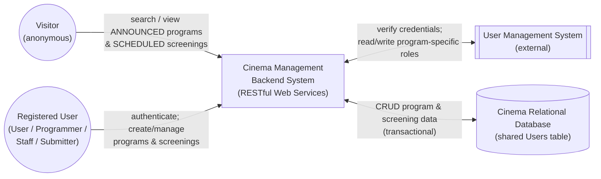

# Context Diagram — Cinema Management Backend System

Αναλυτική επεξήγηση: βλ. `README.md` §2.1.

```mermaid
flowchart LR
    Visitor(("Visitor<br/>(anonymous)"))
    RegUser(("Registered User<br/>(User / Programmer /<br/>Staff / Submitter)"))
    Sys["Cinema Management<br/>Backend System<br/>(RESTful Web Services)"]
    UserMgmt[["User Management System<br/>(external)"]]
    DB[("Cinema Relational Database<br/>(shared Users table)")]

    Visitor -->|"search / view ANNOUNCED programs<br/>& SCHEDULED screenings"| Sys
    RegUser -->|"authenticate; create/manage<br/>programs & screenings"| Sys
    Sys <-->|"verify credentials;<br/>read/write program-specific roles"| UserMgmt
    Sys <-->|"CRUD program & screening data<br/>(transactional)"| DB
```
