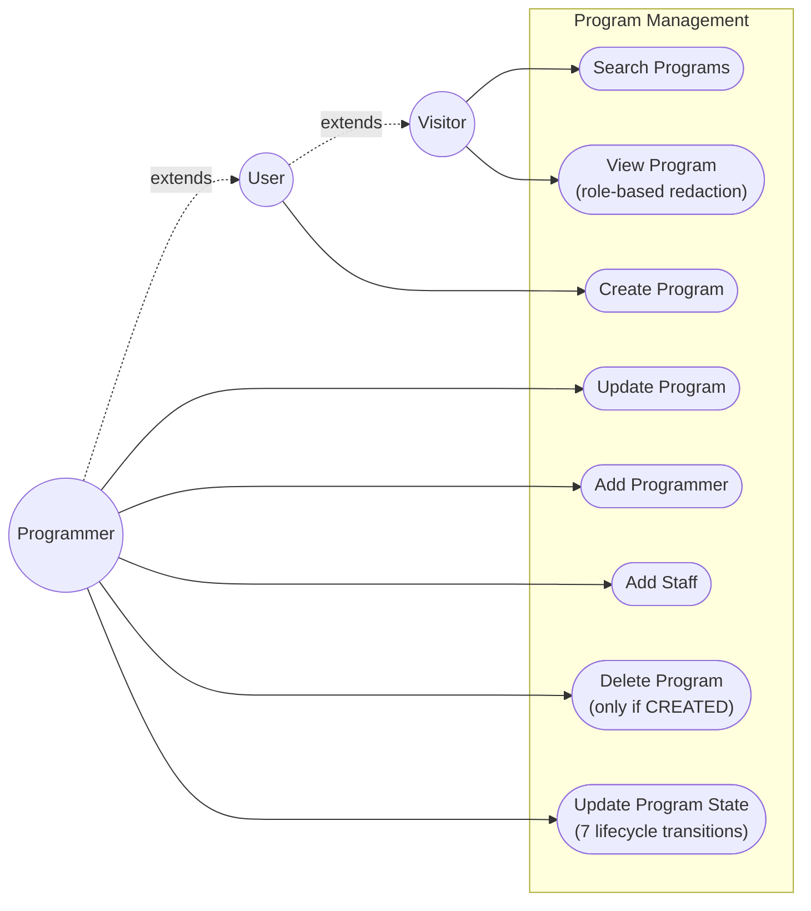

# Use Case Diagram — Program (Season) Management

Αναλυτική επεξήγηση: βλ. `README.md` §3.1.

```mermaid
flowchart LR
    Visitor(("Visitor"))
    User(("User"))
    Programmer(("Programmer"))

    User -.->|extends| Visitor
    Programmer -.->|extends| User

    subgraph PM["Program Management"]
        UC1(["Search Programs"])
        UC2(["View Program<br/>(role-based redaction)"])
        UC3(["Create Program"])
        UC4(["Update Program"])
        UC5(["Add Programmer"])
        UC6(["Add Staff"])
        UC7(["Delete Program<br/>(only if CREATED)"])
        UC8(["Update Program State<br/>(7 lifecycle transitions)"])
    end

    Visitor --> UC1
    Visitor --> UC2
    User --> UC3
    Programmer --> UC4
    Programmer --> UC5
    Programmer --> UC6
    Programmer --> UC7
    Programmer --> UC8
```
