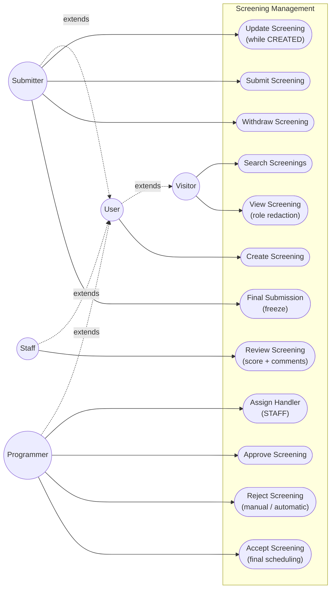

# Use Case Diagram — Screening Management

Αναλυτική επεξήγηση: βλ. `README.md` §3.2.

```mermaid
flowchart LR
    Visitor(("Visitor"))
    User(("User"))
    Submitter(("Submitter"))
    Staff(("Staff"))
    Programmer(("Programmer"))

    User -.->|extends| Visitor
    Submitter -.->|extends| User
    Staff -.->|extends| User
    Programmer -.->|extends| User

    subgraph SM["Screening Management"]
        UC1(["Search Screenings"])
        UC2(["View Screening<br/>(role redaction)"])
        UC3(["Create Screening"])
        UC4(["Update Screening<br/>(while CREATED)"])
        UC5(["Submit Screening"])
        UC6(["Withdraw Screening"])
        UC7(["Final Submission<br/>(freeze)"])
        UC8(["Review Screening<br/>(score + comments)"])
        UC9(["Assign Handler<br/>(STAFF)"])
        UC10(["Approve Screening"])
        UC11(["Reject Screening<br/>(manual / automatic)"])
        UC12(["Accept Screening<br/>(final scheduling)"])
    end

    Visitor --> UC1
    Visitor --> UC2
    User --> UC3
    Submitter --> UC4
    Submitter --> UC5
    Submitter --> UC6
    Submitter --> UC7
    Staff --> UC8
    Programmer --> UC9
    Programmer --> UC10
    Programmer --> UC11
    Programmer --> UC12
```
