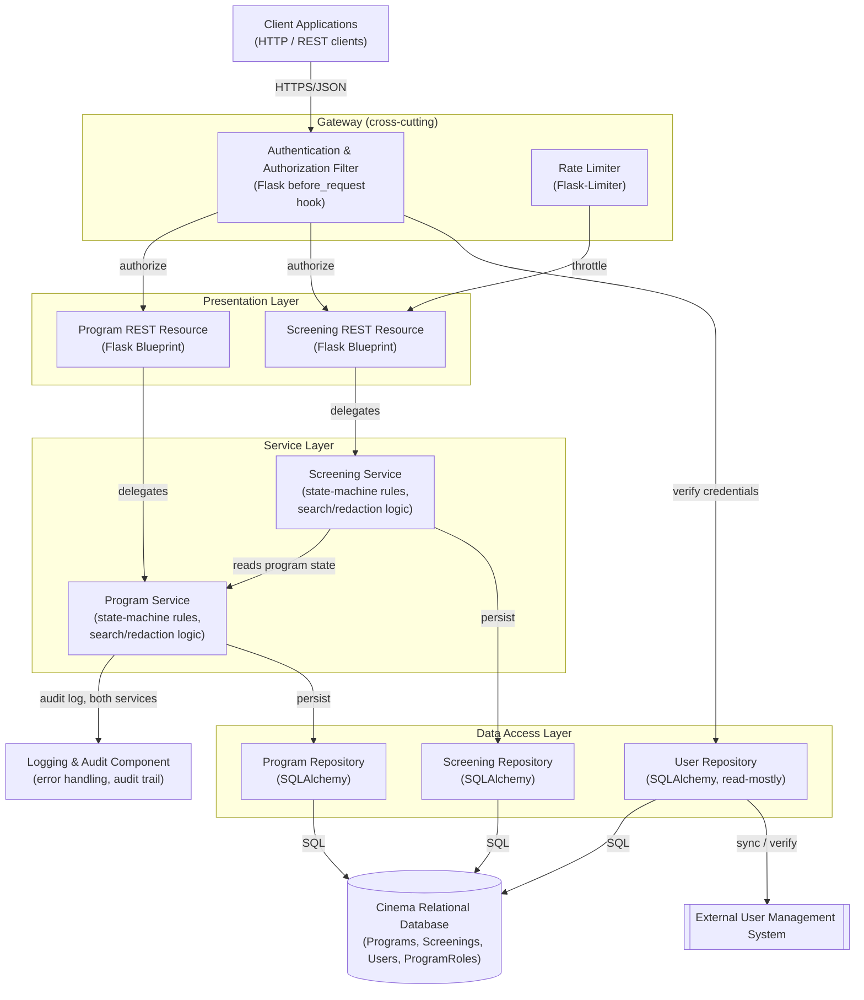

# Component Diagram — System Architecture

Αναλυτική επεξήγηση: βλ. `README.md` §2.2.

```mermaid
flowchart TD
    Client["Client Applications<br/>(HTTP / REST clients)"]

    subgraph GW["Gateway (cross-cutting)"]
        Auth["Authentication & Authorization Filter<br/>(Flask before_request hook)"]
        Rate["Rate Limiter<br/>(Flask-Limiter)"]
    end

    subgraph REST["Presentation Layer"]
        ProgRes["Program REST Resource<br/>(Flask Blueprint)"]
        ScrRes["Screening REST Resource<br/>(Flask Blueprint)"]
    end

    subgraph SVC["Service Layer"]
        ProgSvc["Program Service<br/>(state-machine rules,<br/>search/redaction logic)"]
        ScrSvc["Screening Service<br/>(state-machine rules,<br/>search/redaction logic)"]
    end

    Log["Logging & Audit Component<br/>(error handling, audit trail)"]

    subgraph REPO["Data Access Layer"]
        ProgRepo["Program Repository<br/>(SQLAlchemy)"]
        ScrRepo["Screening Repository<br/>(SQLAlchemy)"]
        UserRepo["User Repository<br/>(SQLAlchemy, read-mostly)"]
    end

    DB[("Cinema Relational Database<br/>(Programs, Screenings, Users, ProgramRoles)")]
    Ext[["External User Management System"]]

    Client -->|"HTTPS/JSON"| Auth
    Auth -->|"authorize"| ProgRes
    Auth -->|"authorize"| ScrRes
    Rate -->|"throttle"| ScrRes
    Auth -->|"verify credentials"| UserRepo
    ProgRes -->|"delegates"| ProgSvc
    ScrRes -->|"delegates"| ScrSvc
    ScrSvc -->|"reads program state"| ProgSvc
    ProgSvc -->|"audit log, both services"| Log
    ProgSvc -->|"persist"| ProgRepo
    ScrSvc -->|"persist"| ScrRepo
    ProgRepo -->|"SQL"| DB
    ScrRepo -->|"SQL"| DB
    UserRepo -->|"SQL"| DB
    UserRepo -->|"sync / verify"| Ext
```
