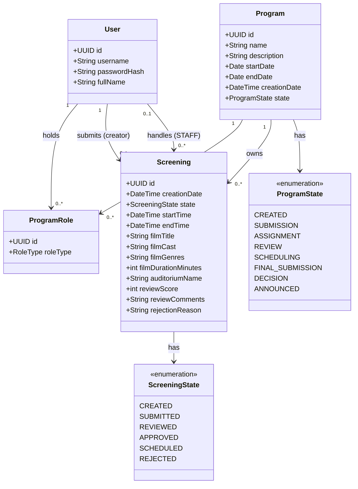

# Class Diagram — Main Informational Entities

Αναλυτική επεξήγηση: βλ. `README.md` §5.1. Μέθοδοι παραλείπονται σκόπιμα (μόνο attributes/relations).

> Σημείωση: το `ProgramRole` είναι η κλάση σύνδεσης User↔Program (many-to-many) με attribute `roleType`. Ο ρόλος SUBMITTER δεν αποθηκεύεται εκεί — προκύπτει έμμεσα από τη σχέση `Screening.submitter`.
