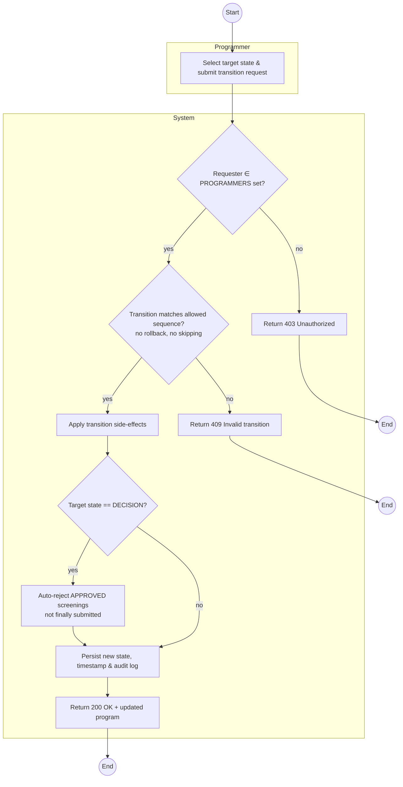

# Activity Diagram — Program Lifecycle State Update

Καλύπτει το use case Program State Update (7 μεταβάσεις). Αναλυτική επεξήγηση: βλ. `README.md` §4.1.

```mermaid
flowchart TD
    subgraph Programmer
        A1[Select target state & submit transition request]
    end
    subgraph System
        D1{Requester ∈ PROGRAMMERS set?}
        E1[Return 403 Unauthorized]
        D2{Transition matches allowed sequence?<br/>no rollback, no skipping}
        E2[Return 409 Invalid transition]
        A2[Apply transition side-effects]
        D3{Target state == DECISION?}
        A3[Auto-reject APPROVED screenings<br/>not finally submitted]
        A4[Persist new state, timestamp & audit log]
        A5[Return 200 OK + updated program]
    end

    Start((Start)) --> A1 --> D1
    D1 -->|no| E1 --> End1((End))
    D1 -->|yes| D2
    D2 -->|no| E2 --> End2((End))
    D2 -->|yes| A2 --> D3
    D3 -->|yes| A3 --> A4
    D3 -->|no| A4
    A4 --> A5 --> End3((End))
```
