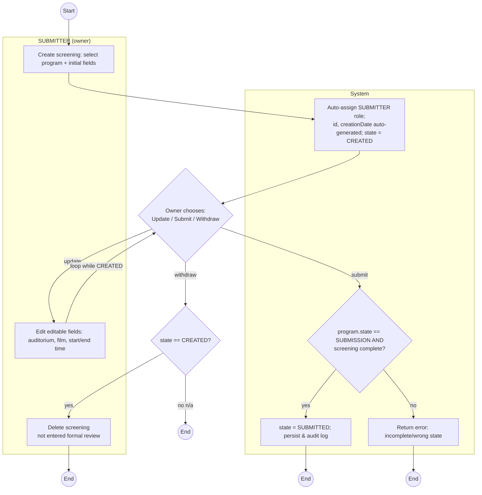

# Activity Diagram — Screening Submission Workflow

Καλύπτει: creation, update, submission, withdrawal. Αναλυτική επεξήγηση: βλ. `README.md` §4.2.

```mermaid
flowchart TD
    subgraph Submitter["SUBMITTER (owner)"]
        A1[Create screening: select program + initial fields]
        A2[Edit editable fields: auditorium, film, start/end time]
        A5[Delete screening<br/>not entered formal review]
    end
    subgraph System
        A3[Auto-assign SUBMITTER role;<br/>id, creationDate auto-generated; state = CREATED]
        D2{program.state == SUBMISSION AND<br/>screening complete?}
        A6[state = SUBMITTED; persist & audit log]
        E1[Return error: incomplete/wrong state]
    end

    Start((Start)) --> A1 --> A3 --> D1{Owner chooses:<br/>Update / Submit / Withdraw}
    D1 -->|"update"| A2 -->|"loop while CREATED"| D1
    D1 -->|"withdraw"| D3{state == CREATED?}
    D3 -->|"yes"| A5 --> End1((End))
    D3 -->|"no n/a"| End2((End))
    D1 -->|"submit"| D2
    D2 -->|"yes"| A6 --> End3((End))
    D2 -->|"no"| E1 --> End4((End))
```
