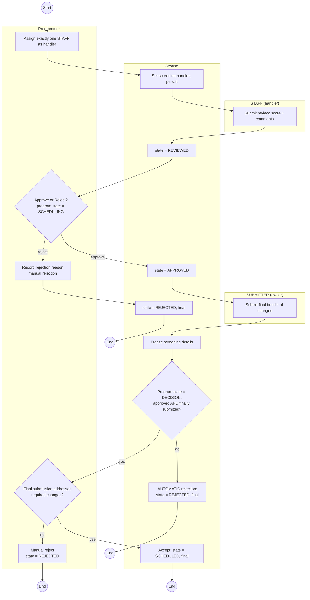

# Activity Diagram — Screening Review → Decision Workflow

Καλύπτει: assign handler, review, approve, reject (manual & automatic), final submission, acceptance. Αναλυτική επεξήγηση: βλ. `README.md` §4.3.

