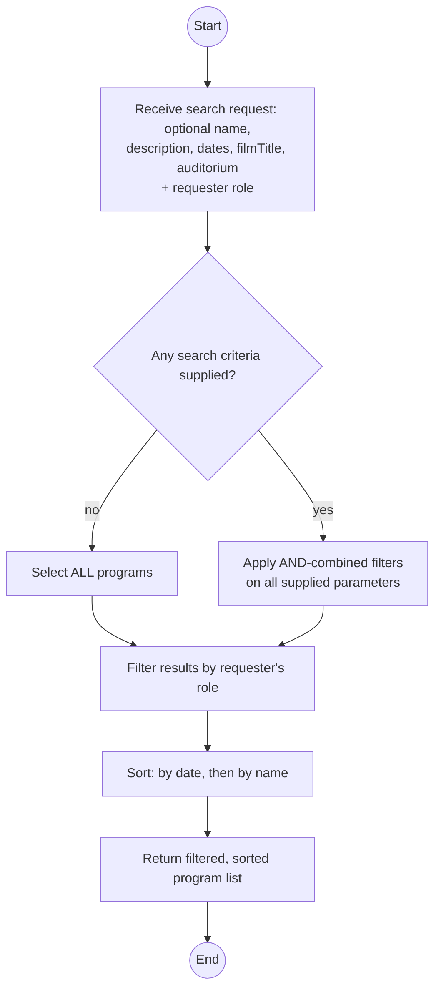

# Activity Diagram — Program Search

Αναλυτική επεξήγηση: βλ. `README.md` §4.4.

```mermaid
flowchart TD
    Start((Start)) --> A1[Receive search request: optional name,<br/>description, dates, filmTitle, auditorium<br/>+ requester role]
    A1 --> D1{Any search criteria supplied?}
    D1 -->|no| A2[Select ALL programs]
    D1 -->|yes| A3[Apply AND-combined filters<br/>on all supplied parameters]
    A2 --> A4[Filter results by requester's role]
    A3 --> A4
    A4 --> A5[Sort: by date, then by name]
    A5 --> A6[Return filtered, sorted program list]
    A6 --> End((End))
```
