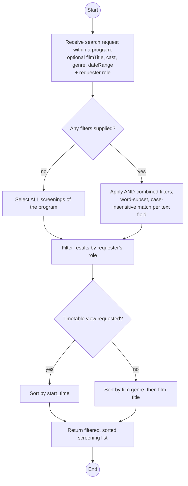

# Activity Diagram — Screening Search

Αναλυτική επεξήγηση: βλ. `README.md` §4.5.

```mermaid
flowchart TD
    Start((Start)) --> A1[Receive search request within a program:<br/>optional filmTitle, cast, genre, dateRange<br/>+ requester role]
    A1 --> D1{Any filters supplied?}
    D1 -->|"no"| A2[Select ALL screenings of the program]
    D1 -->|"yes"| A3[Apply AND-combined filters;<br/>word-subset, case-insensitive match per text field]
    A2 --> A4[Filter results by requester's role]
    A3 --> A4
    A4 --> D2{Timetable view requested?}
    D2 -->|"yes"| A5[Sort by start_time]
    D2 -->|"no"| A6[Sort by film genre, then film title]
    A5 --> A7[Return filtered, sorted screening list]
    A6 --> A7
    A7 --> End((End))
```
