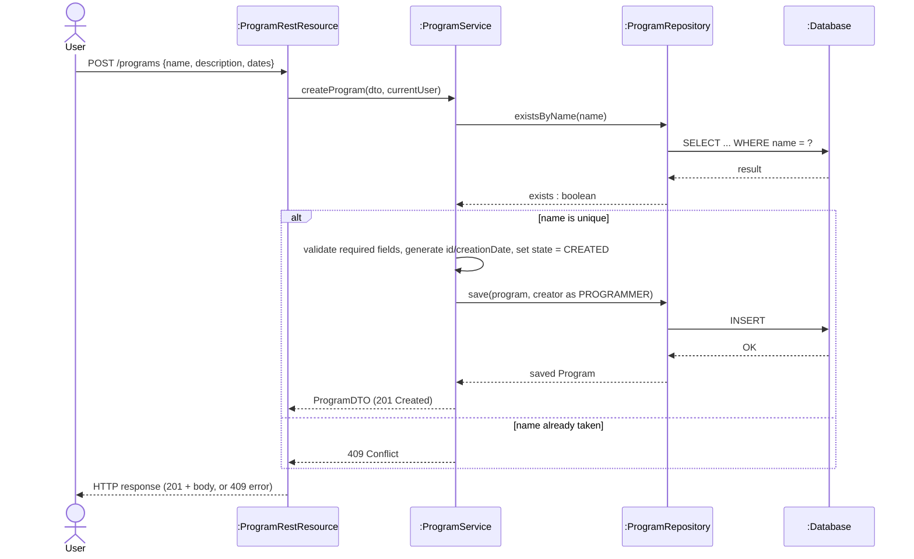

# Sequence Diagram — Program Creation

Αναλυτική επεξήγηση: βλ. `README.md` §4.6.

```mermaid
sequenceDiagram
    actor User
    participant Res as :ProgramRestResource
    participant Svc as :ProgramService
    participant Repo as :ProgramRepository
    participant DB as :Database

    User->>Res: POST /programs {name, description, dates}
    Res->>Svc: createProgram(dto, currentUser)
    Svc->>Repo: existsByName(name)
    Repo->>DB: SELECT ... WHERE name = ?
    DB-->>Repo: result
    Repo-->>Svc: exists : boolean
    alt name is unique
        Svc->>Svc: validate required fields, generate id/creationDate, set state = CREATED
        Svc->>Repo: save(program, creator as PROGRAMMER)
        Repo->>DB: INSERT
        DB-->>Repo: OK
        Repo-->>Svc: saved Program
        Svc-->>Res: ProgramDTO (201 Created)
    else name already taken
        Svc-->>Res: 409 Conflict
    end
    Res-->>User: HTTP response (201 + body, or 409 error)
```
