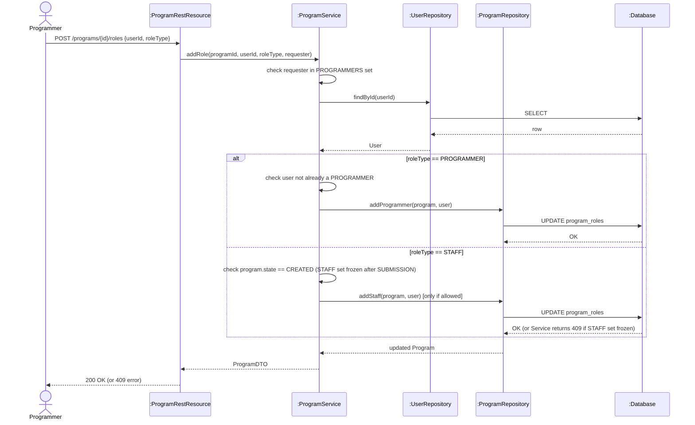

# Sequence Diagram — Add Programmer / Add Staff

Αναλυτική επεξήγηση: βλ. `README.md` §4.6.

```mermaid
sequenceDiagram
    actor Programmer
    participant Res as :ProgramRestResource
    participant Svc as :ProgramService
    participant URepo as :UserRepository
    participant PRepo as :ProgramRepository
    participant DB as :Database

    Programmer->>Res: POST /programs/{id}/roles {userId, roleType}
    Res->>Svc: addRole(programId, userId, roleType, requester)
    Svc->>Svc: check requester in PROGRAMMERS set
    Svc->>URepo: findById(userId)
    URepo->>DB: SELECT
    DB-->>URepo: row
    URepo-->>Svc: User
    alt roleType == PROGRAMMER
        Svc->>Svc: check user not already a PROGRAMMER
        Svc->>PRepo: addProgrammer(program, user)
        PRepo->>DB: UPDATE program_roles
        DB-->>PRepo: OK
    else roleType == STAFF
        Svc->>Svc: check program.state == CREATED (STAFF set frozen after SUBMISSION)
        Svc->>PRepo: addStaff(program, user) [only if allowed]
        PRepo->>DB: UPDATE program_roles
        DB-->>PRepo: OK (or Service returns 409 if STAFF set frozen)
    end
    PRepo-->>Svc: updated Program
    Svc-->>Res: ProgramDTO
    Res-->>Programmer: 200 OK (or 409 error)
```
