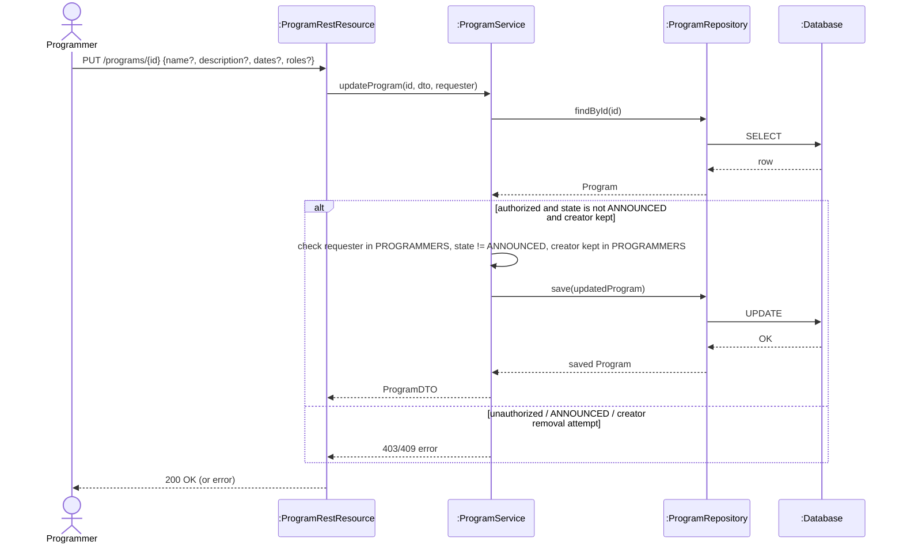

# Sequence Diagram — Program Update

Αναλυτική επεξήγηση: βλ. `README.md` §4.6.

```mermaid
sequenceDiagram
    actor Programmer
    participant Res as :ProgramRestResource
    participant Svc as :ProgramService
    participant Repo as :ProgramRepository
    participant DB as :Database

    Programmer->>Res: PUT /programs/{id} {name?, description?, dates?, roles?}
    Res->>Svc: updateProgram(id, dto, requester)
    Svc->>Repo: findById(id)
    Repo->>DB: SELECT
    DB-->>Repo: row
    Repo-->>Svc: Program
    alt authorized and state is not ANNOUNCED and creator kept
        Svc->>Svc: check requester in PROGRAMMERS, state != ANNOUNCED, creator kept in PROGRAMMERS
        Svc->>Repo: save(updatedProgram)
        Repo->>DB: UPDATE
        DB-->>Repo: OK
        Repo-->>Svc: saved Program
        Svc-->>Res: ProgramDTO
    else unauthorized / ANNOUNCED / creator removal attempt
        Svc-->>Res: 403/409 error
    end
    Res-->>Programmer: 200 OK (or error)
```
