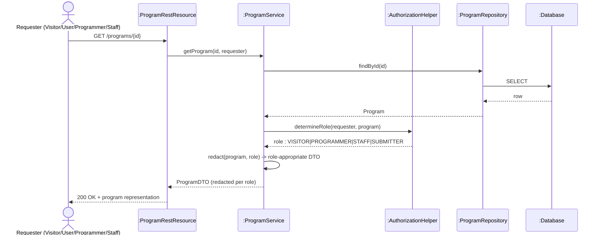

# Sequence Diagram — Program View (role-based redaction)

Αναλυτική επεξήγηση: βλ. `README.md` §4.6.

```mermaid
sequenceDiagram
    actor Requester as Requester (Visitor/User/Programmer/Staff)
    participant Res as :ProgramRestResource
    participant Svc as :ProgramService
    participant Auth as :AuthorizationHelper
    participant Repo as :ProgramRepository
    participant DB as :Database

    Requester->>Res: GET /programs/{id}
    Res->>Svc: getProgram(id, requester)
    Svc->>Repo: findById(id)
    Repo->>DB: SELECT
    DB-->>Repo: row
    Repo-->>Svc: Program
    Svc->>Auth: determineRole(requester, program)
    Auth-->>Svc: role : VISITOR|PROGRAMMER|STAFF|SUBMITTER
    Svc->>Svc: redact(program, role) -> role-appropriate DTO
    Svc-->>Res: ProgramDTO (redacted per role)
    Res-->>Requester: 200 OK + program representation
```
