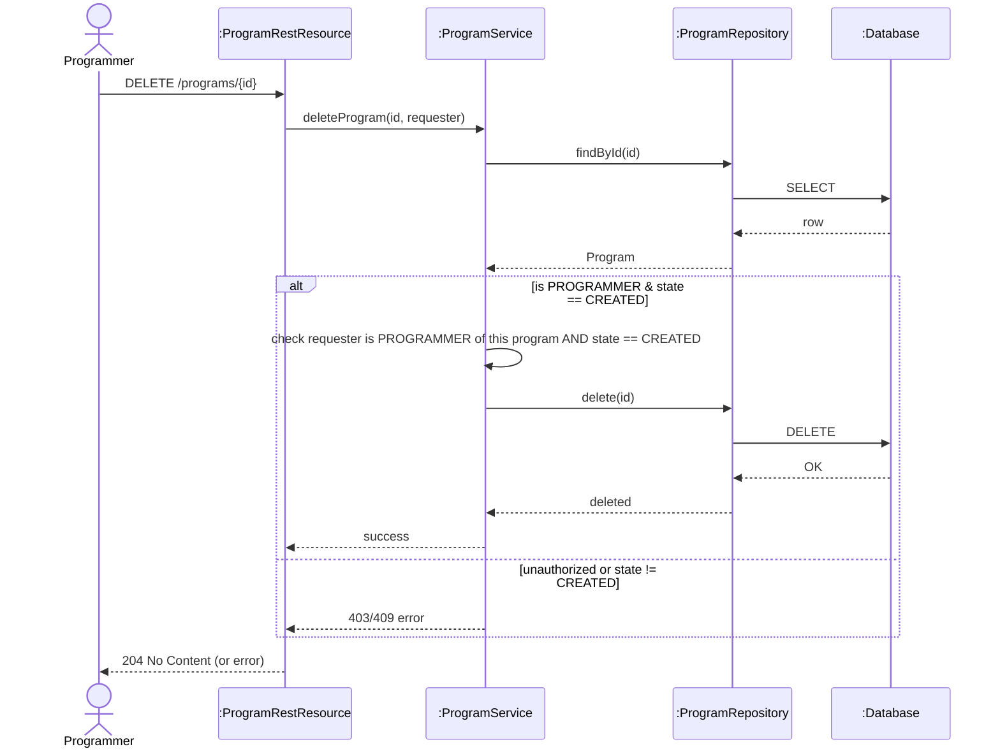

# Sequence Diagram — Program Deletion

Αναλυτική επεξήγηση: βλ. `README.md` §4.6.

```mermaid
sequenceDiagram
    actor Programmer
    participant Res as :ProgramRestResource
    participant Svc as :ProgramService
    participant Repo as :ProgramRepository
    participant DB as :Database

    Programmer->>Res: DELETE /programs/{id}
    Res->>Svc: deleteProgram(id, requester)
    Svc->>Repo: findById(id)
    Repo->>DB: SELECT
    DB-->>Repo: row
    Repo-->>Svc: Program
    alt is PROGRAMMER & state == CREATED
        Svc->>Svc: check requester is PROGRAMMER of this program AND state == CREATED
        Svc->>Repo: delete(id)
        Repo->>DB: DELETE
        DB-->>Repo: OK
        Repo-->>Svc: deleted
        Svc-->>Res: success
    else unauthorized or state != CREATED
        Svc-->>Res: 403/409 error
    end
    Res-->>Programmer: 204 No Content (or error)
```
