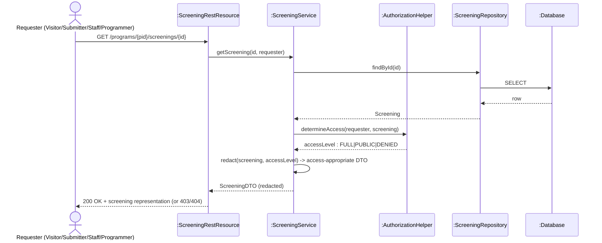

# Sequence Diagram — Screening View (role-based redaction)

Αναλυτική επεξήγηση: βλ. `README.md` §4.6.

```mermaid
sequenceDiagram
    actor Requester as Requester (Visitor/Submitter/Staff/Programmer)
    participant Res as :ScreeningRestResource
    participant Svc as :ScreeningService
    participant Auth as :AuthorizationHelper
    participant Repo as :ScreeningRepository
    participant DB as :Database

    Requester->>Res: GET /programs/{pid}/screenings/{id}
    Res->>Svc: getScreening(id, requester)
    Svc->>Repo: findById(id)
    Repo->>DB: SELECT
    DB-->>Repo: row
    Repo-->>Svc: Screening
    Svc->>Auth: determineAccess(requester, screening)
    Auth-->>Svc: accessLevel : FULL|PUBLIC|DENIED
    Svc->>Svc: redact(screening, accessLevel) -> access-appropriate DTO
    Svc-->>Res: ScreeningDTO (redacted)
    Res-->>Requester: 200 OK + screening representation (or 403/404)
```
