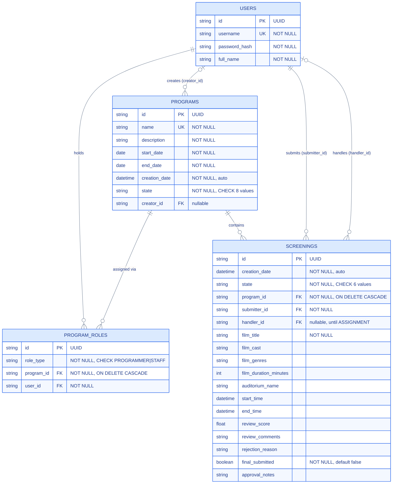

# ER Diagram (Analytic) — Relational Schema

Αναλυτικό Entity-Relationship diagram σε επίπεδο **γνησίων relational πινάκων** (PK/FK/UK, τύποι στηλών, cardinalities), σε αντίθεση με το `05-class-diagram.md` που δείχνει τις πληροφοριακές οντότητες σε επίπεδο UML/domain model. Πηγή αλήθειας: `sql/schema.sql` (τηρείται συγχρονισμένο με τα SQLAlchemy models του `app/models/` μέσω `tests/test_sql_schema.py`).

## Σημειώσεις

- **`PROGRAM_ROLES`** είναι ο πίνακας σύνδεσης (join table) της many-to-many σχέσης `USERS` ↔ `PROGRAMS`, με επιπλέον composite unique constraint `UNIQUE (program_id, user_id)` — το πολύ ένας ρόλος ανά ζεύγος (χρήστης, πρόγραμμα). Ο τύπος ρόλου (`PROGRAMMER` / `STAFF`) περιορίζεται με `CHECK`.
- Ο ρόλος **SUBMITTER δεν αποθηκεύεται** στο `PROGRAM_ROLES` — προκύπτει έμμεσα από το FK `screenings.submitter_id` (βλ. παραδοχή §0.4 στο `README.md`), γι' αυτό εμφανίζεται εδώ ως ξεχωριστή σχέση `USERS ||--o{ SCREENINGS : submits`, ανεξάρτητη από το `PROGRAM_ROLES`.
- `programs.creator_id` και `screenings.handler_id` είναι **nullable** FKs (χωρίς `ON DELETE CASCADE`) → προαιρετική συμμετοχή (`|o`) στην πλευρά `USERS`. Όλα τα υπόλοιπα FKs είναι υποχρεωτικά (`||`).
- `program_roles.program_id` και `screenings.program_id` έχουν `ON DELETE CASCADE` — η διαγραφή ενός `PROGRAMS` διαγράφει αυτόματα τους σχετικούς ρόλους και προβολές του.
- Ευρετήρια (`ix_program_roles_program`, `ix_program_roles_user`, `ix_screenings_program`, `ix_screenings_submitter`, `ix_screenings_start_time`) υποστηρίζουν τα φίλτρα αναζήτησης των `06`/`09`/`10` και παραλείπονται εδώ ως μη-δομικά στοιχεία του μοντέλου δεδομένων.
